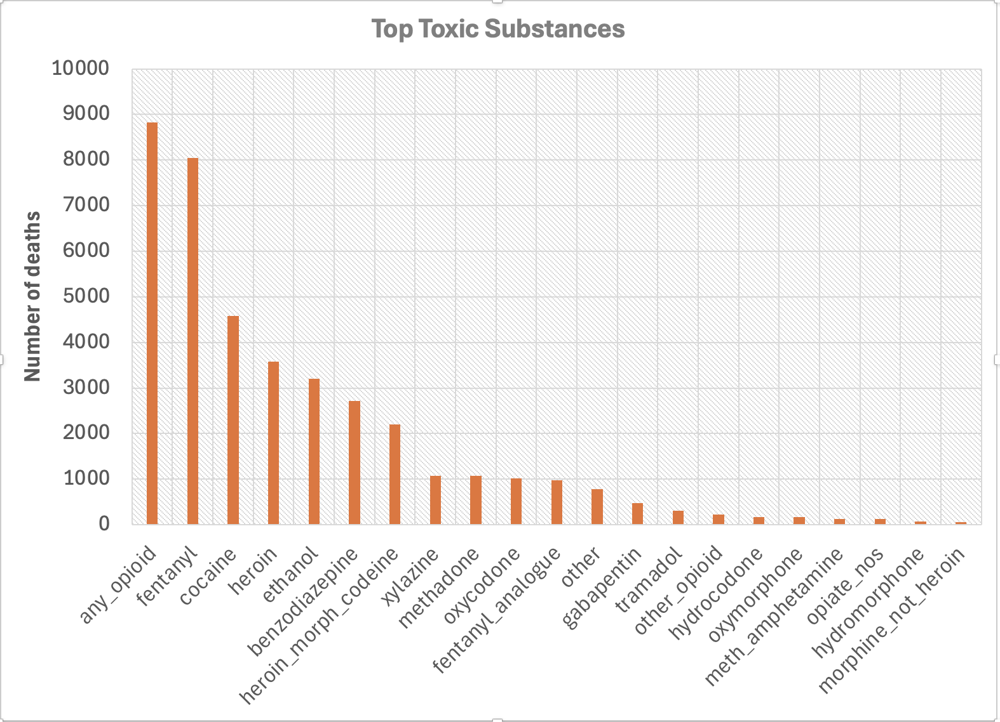
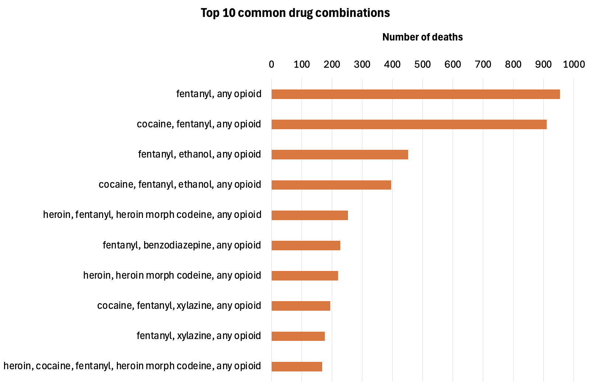
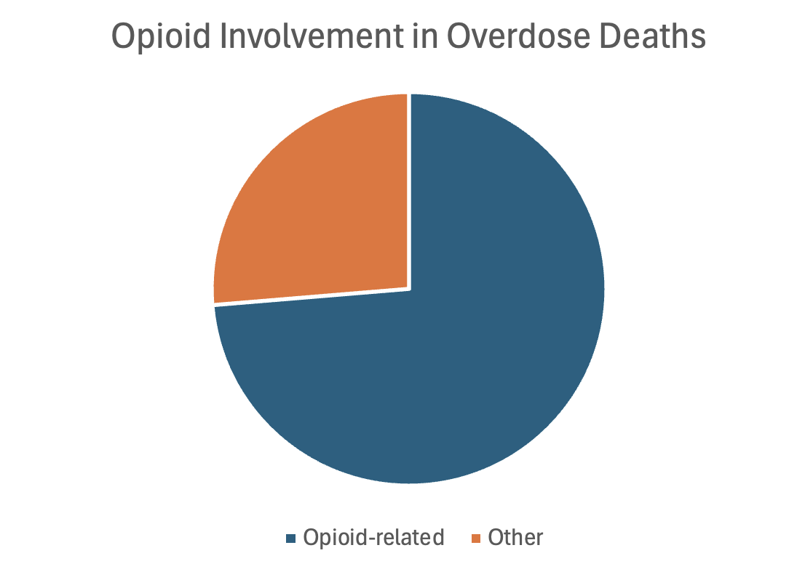
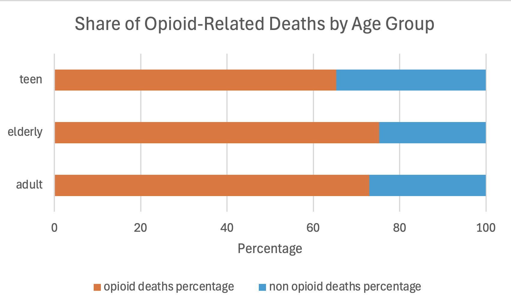
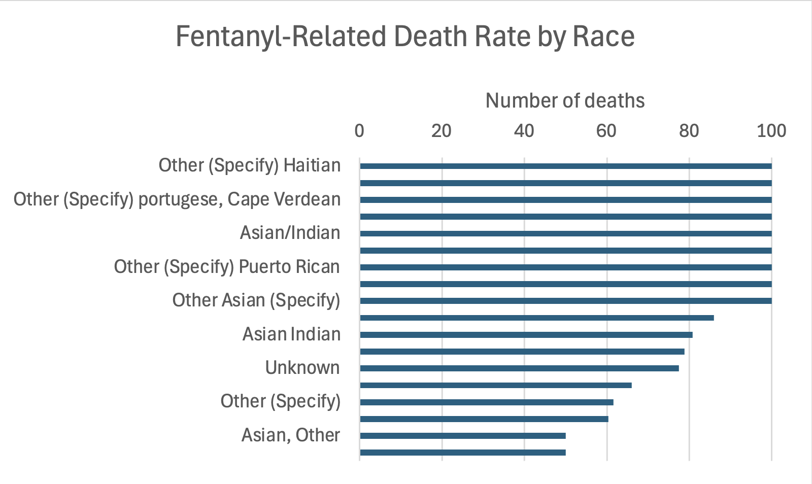
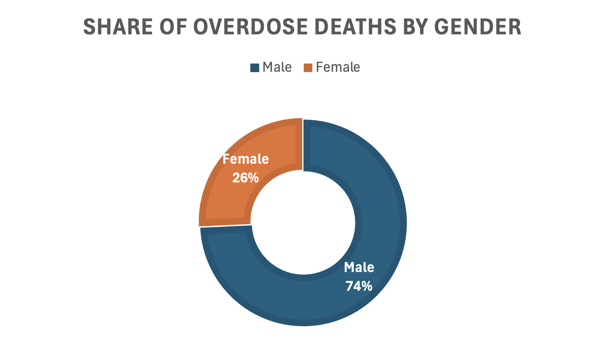
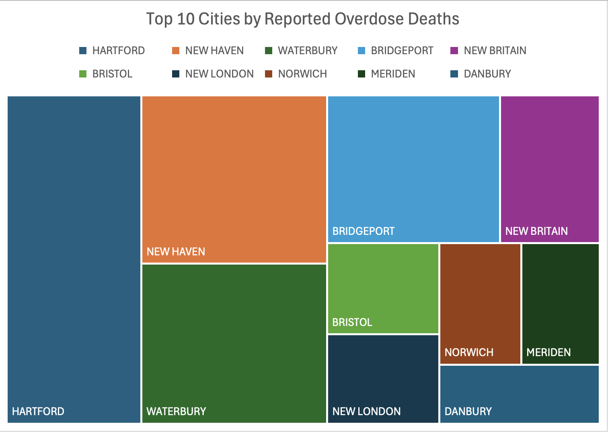
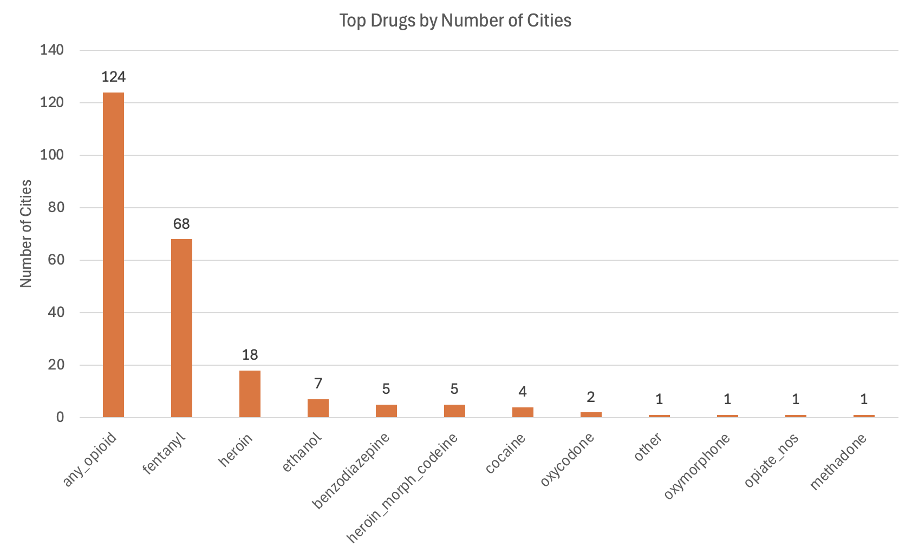
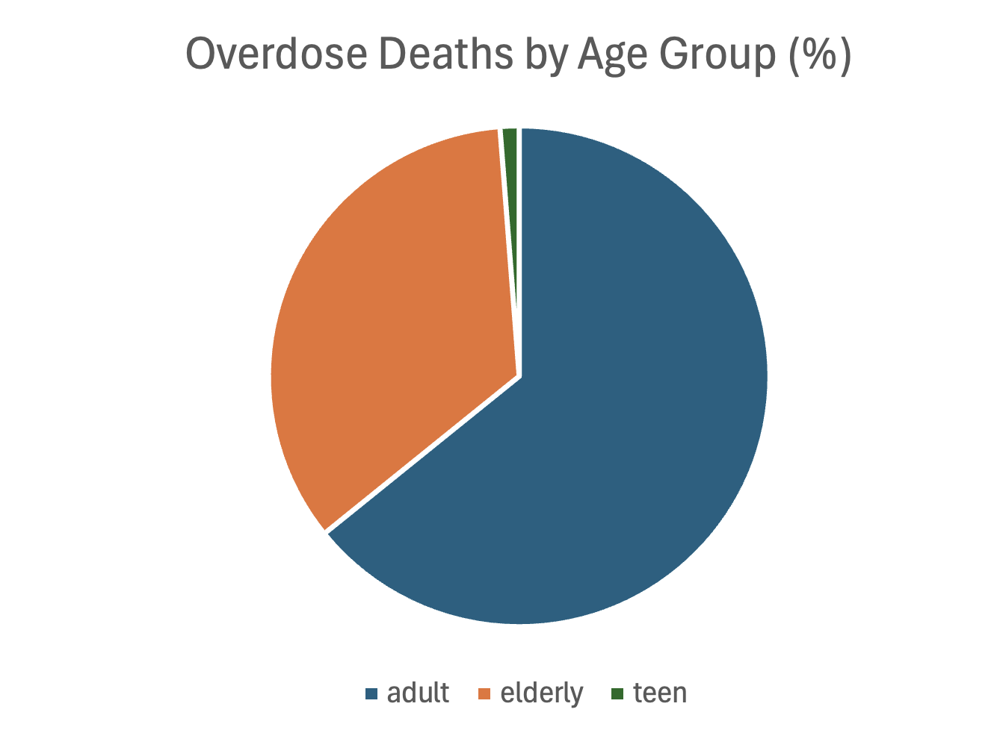
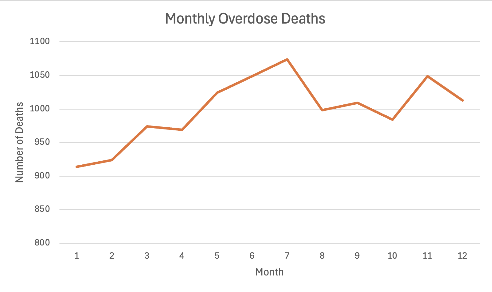

# Introduction
💀 Step into the dark reality of drug overdose data. In this project, I explored mortality statistics caused by toxic substances — analyzing the most deadly drugs, common combinations, and geographic hotspots. Using SQL for data extraction and Excel for visualization, I identified trends by age, gender, race, and month.

📌 From fentanyl-related deaths to opioid prevalence across cities, this analysis aims to raise awareness and highlight critical patterns in substance-related mortality.

- 🔍 SQL queries? Check them out here: [sql_files foled](/sql_files/)
- 📈 Excel visualizations? View them here: [excel_file folder](/excel_file/)

# Background
Motivated by a growing public health concern, this project explores drug overdose deaths in the United States through a detailed data-driven approach. Using structured SQL queries, I analyzed large datasets to uncover trends and patterns in substance-related mortality. Each SQL query was followed by Excel visualizations — clear, impactful charts and graphs — to bring the insights to life and make the findings more accessible.

This project is not only about querying data but also about telling a compelling story using visuals and real-world implications. It highlights which substances are most deadly, how overdose patterns shift across age, gender, race, location, and time, and where intervention might be most needed.

💡 The questions I wanted to answer through my SQL queries were:
1. Which toxic substances are responsible for the highest number of overdose deaths?
2. What drug combinations are most common among overdose cases?
3. What percentage of overdose deaths involve opioids?
4. How are opioid-related deaths distributed across age groups?
5. What is the racial distribution of fentanyl-related deaths?
6. What is the gender distribution in drug overdose deaths?
7. How do drug-related deaths vary by city?
8. Which drug is the leading cause of death in each city?
9. What is the overall age distribution of overdose deaths?
10. Which months record the highest number of overdose deaths?

# Tools I Used
To carry out this end-to-end analysis of drug overdose deaths, I relied on the following tools:

- **SQL:** The core language used to extract and manipulate data, allowing me to uncover meaningful trends from complex datasets.

- **PostgreSQL:** My database management system of choice — efficient and reliable for handling overdose mortality data.

- **Visual Studio Code:** My primary environment for writing and managing SQL scripts in an organized and efficient workflow.

- **Git & GitHub:** Essential tools for version control, backup, and sharing my SQL code and analysis with others.

- **Excel:** Used for building all visualizations — including bar charts, pie charts, and trend lines — to clearly communicate insights from the data.

# The Analysis
Each SQL query in this project was designed to uncover a different aspect of drug-related mortality. The goal was to understand not only which substances are the most lethal, but also who is affected, where, and when. Here's how I approached each analytical question:

### 1. Which toxic substances are responsible for the highest number of overdose deaths?
To identify the most lethal substances involved in overdose deaths, I queried the toxicology_results table for a wide range of commonly known drugs. Each drug was checked for presence (marked TRUE) in the toxicology report, and I used a UNION ALL approach to count the number of fatalities per substance. The results were ordered from highest to lowest death count to highlight the deadliest contributors.


*These results were visualized in Excel using a bar chart, making it easy to compare the death counts across substances at a glance.*

#### Key Findings:
1. Opioids dominate the list: The generic category any_opioid accounted for the highest number of deaths (over 8,800 cases), followed closely by fentanyl with around 8,000 deaths.

2. Cocaine and heroin were also major contributors, with roughly 4,500 and 3,500 deaths respectively.

3. Other substances like ethanol, benzodiazepine, and xylazine also appeared frequently, showing the impact of non-opioid drugs in overdose cases.

### 2. What drug combinations are most common among overdose cases?
To investigate which combinations of substances were most frequently present in fatal overdose cases, I created a CTE (WITH combinations AS) that scanned each row in the toxicology_results table. The logic counted how many substances were marked TRUE per case and constructed a readable string listing those substances. Only combinations involving two or more drugs were included in the final output.

The resulting data was grouped by combination and sorted by total deaths to identify the top 10 most common multi-drug mixtures.


*I visualized the top 10 combinations in a horizontal bar chart in Excel, clearly illustrating how often each deadly mix appeared.*

#### Key Findings:
1. Fentanyl + any opioid was the most deadly combination, appearing in nearly 1,000 fatal cases.

2. Cocaine + fentanyl + any opioid followed closely, showing that polydrug use involving stimulants and opioids is especially lethal.

3. Other frequently seen combos included fentanyl + ethanol, fentanyl + benzodiazepine, and cocaine + fentanyl + xylazine.

4. Several top combinations involved four or more substances, indicating a high level of drug interaction complexity in many overdoses.

### 3. What percentage of overdose deaths involve opioids?
To measure the scope of the opioid crisis, I calculated the percentage of overdose deaths where any opioid was present. This was done using a Common Table Expression (CTE) to count cases with any_opioid = TRUE in the toxicology_results table, then dividing that count by the total number of overdose cases.

This query provided a clear indicator of how prevalent opioids are across all recorded drug-related fatalities.

```sql
WITH opiod_deaths AS
(
    SELECT 
        COUNT(*) AS opiod_count
    FROM toxicology_results
    WHERE
        any_opioid = TRUE
), 
total_deaths AS (
    SELECT
        COUNT(*) total_count
    FROM toxicology_results
)
SELECT 
    ROUND(100.0 * opiod_deaths.opiod_count / total_deaths.total_count, 2) AS opiod_percent
FROM opiod_deaths, total_deaths
```


*The results were visualized with a pie chart in Excel to emphasize the proportion of opioid-related deaths relative to other substances.*

#### Key Findings:
1. Approximately 73.68% of all overdose deaths involved at least one opioid.

2. This statistic confirms that opioids — including fentanyl, heroin, oxycodone, and others — are at the core of the overdose epidemic.

3. Non-opioid drugs accounted for only about 26% of cases, showing how overwhelmingly opioids drive fatal outcomes.

### 4. How are opioid-related deaths distributed across age groups?
To understand how different age groups are affected by opioid overdoses, I categorized individuals into three groups: teens (10–20), adults (20–50), and elderly (50+). Using CTEs, I calculated the total number of deaths in each group and then filtered for cases where any_opioid = TRUE to isolate opioid-related fatalities. This allowed me to compute the percentage of opioid-related deaths within each age group.


*I visualized this data with a 100% stacked bar chart in Excel, clearly showing the share of opioid-related vs. non-opioid deaths for each group.*

#### Key Findings:
1. Teens had the highest proportion of opioid-related deaths, with over 70% of cases involving opioids.

2. Adults followed closely, showing a similar pattern of high opioid presence.

3. Even among the elderly, opioids were involved in a significant share of overdose deaths, indicating that the crisis spans all age groups.

### 5. What is the racial distribution of fentanyl-related deaths?
To analyze how fentanyl affects different racial groups, I joined the victim_profiles and toxicology_results tables using row_id, filtering only those records where the race value was present. I then calculated the percentage of fentanyl-related deaths within each racial group using two CTEs: one for total deaths and another specifically for cases where fentanyl = TRUE.


*A horizontal bar chart created in Excel visualizes these fentanyl-involvement rates by race, sorted in descending order to highlight the most affected groups.*

#### Key Findings:
1. Several groups had a 100% fentanyl-involvement rate, including:
- Haitian
- Portuguese, Cape Verdean
- Asian/Indian
- Puerto Rican

2. These insights reveal significant racial disparities in fentanyl-related overdose deaths.

### 6. What is the gender distribution in drug overdose deaths?
To examine how overdose fatalities vary by gender, I queried the victim_profiles table and grouped deaths by the sex column. A HAVING clause was used to exclude any categories with very few observations (less than or equal to 10) to keep results reliable. I then calculated each gender’s share of the total death count.

```sql
WITH deaths_by_sex_cte AS
(
    SELECT
        sex,
        COUNT(*) deaths
    FROM victim_profiles
    GROUP BY
        sex
    HAVING
        COUNT(*) > 10
)
SELECT
    dbs.sex,
    dbs.deaths,
    ROUND(dbs.deaths * 100.0 / 
    (
        SELECT 
            COUNT(*) total_deaths
        FROM victim_profiles
    ), 2) AS deaths_percentage
FROM deaths_by_sex_cte AS dbs

```


*I used a donut chart in Excel to make this gender gap visually impactful and easy to interpret at a glance.*

#### Key Findings:
1. 74% of overdose deaths were male, while only 26% were female.

2. This stark imbalance highlights that men are nearly three times more likely to die from drug overdoses than women.

3. The reasons may include risk behavior differences, access to substances, or treatment disparities — pointing to a need for gender-specific prevention strategies.

### 7. How do drug-related deaths vary by city?
To identify geographic hotspots of overdose fatalities, I grouped all death records from the victim_profiles table by death_city. Cities with null values were excluded, and the remaining data was aggregated to count the number of deaths per location. The results were sorted in descending order to highlight the most affected areas.

``` sql
SELECT
    death_city,
    COUNT(*) AS deaths
FROM victim_profiles
WHERE
    death_city IS NOT NULL
GROUP BY
    death_city
ORDER BY
    deaths DESC
```


*A treemap chart in Excel was used to visualize the top 10 cities, making it easy to compare death counts through proportional block sizes.*

#### Key Findings:
1. The top 3 cities with the highest overdose death counts were Hartford, New Haven, and Waterbury.

2. Other cities with notably high numbers included Bridgeport, New Britain, and Bristol.

3. This distribution shows that urban centers face a disproportionate burden of overdose deaths, which could be linked to population density, access to substances, or socioeconomic conditions.

### 8. Which drug is the leading cause of death in each city?
To determine which substance is the most deadly in each city, I used a series of UNION ALL queries to count fatalities per drug per city. The query spans over 20 substances, ranging from opioids like fentanyl and heroin to depressants like benzodiazepines and ethanol. After collecting all counts, I used a ROW_NUMBER() window function to select the top-ranking drug per city.


*A bar chart in Excel illustrates the number of cities for which each substance was the leading cause of overdose deaths.*


#### Key Findings:
1. Any opioid was the top cause of death in 124 cities, confirming its overwhelming dominance in the overdose crisis.

2. Fentanyl was the most lethal substance in 68 cities, making it the second most common top drug.

3. Other top-ranked drugs like heroin, ethanol, and benzodiazepine only led in a small number of cities — fewer than 10 each.

4. In total, over 10 different substances appeared as the #1 cause in at least one city, reflecting the regional variation in drug impact.

### 9. What is the overall age distribution of overdose deaths?
To get a broad view of age demographics affected by overdose fatalities, I grouped individuals from the victim_profiles table into three categories: teen (10–20), adult (20–50), and elderly (50+). I then calculated both the raw number of deaths and the percentage each group represented out of the total death count.

``` sql
WITH age_groups_cte AS
(
  SELECT
  CASE 
    WHEN age BETWEEN 10 AND 20 THEN 'teen'
    WHEN age BETWEEN 20 AND 50 THEN 'adult'
    ELSE 'elderly'
  END AS age_groups,
  COUNT(*) total
FROM victim_profiles
GROUP BY
  CASE 
    WHEN age BETWEEN 10 AND 20 THEN 'teen'
    WHEN age BETWEEN 20 AND 50 THEN 'adult'
    ELSE 'elderly'
  END
)
SELECT
  age_groups,
  total,
  ROUND( total * 100.0 / (SELECT COUNT(*) FROM victim_profiles) , 2) AS deaths_percentage
FROM age_groups_cte
```


*I used a pie chart in Excel to clearly communicate how the burden of overdose deaths is distributed across age groups.*

#### Key Findings:
1. Adults (20–50) made up the vast majority of overdose deaths, accounting for well over half of all cases.

2. The elderly population also had a notable share, though significantly smaller than adults.

3. Teens had the lowest representation in the data, indicating either lower usage or better survivability.

### 10. Which months record the highest number of overdose deaths?
To explore how overdose fatalities fluctuate over time, I extracted the month from each case’s date in the victim_profiles table. Grouping by month and counting the number of deaths revealed patterns in seasonal or temporal variation.

```sql
SELECT
    EXTRACT(MONTH FROM date) AS month,
    COUNT(*) AS deaths
FROM victim_profiles
GROUP BY
    EXTRACT(MONTH FROM date)
ORDER BY
    deaths DESC
```


*I visualized these findings using a line chart in Excel to show how deaths trend across the calendar year — highlighting peaks and dips with clarity.*


#### Key Findings:
1. The summer months, especially July, recorded the highest number of overdose deaths, peaking above 1,070 cases.

2. Spring (May–June) and late autumn (November) also showed elevated numbers.

3. January and February had the lowest death counts, potentially due to colder weather or reduced activity levels.

# What I Learned
This project significantly deepened my understanding of both SQL and real-world data analysis. Here are the key takeaways:

- SQL Mastery in Practice: I practiced complex query design using CTEs, UNION ALL, JOINs, aggregation, filtering, and window functions — all in the context of real public health data.

- Data Structuring & Categorization: I learned how to segment data effectively — by age, gender, race, city, time — to uncover multidimensional trends.

- Analytical Thinking: It became clear how structured questioning (one query = one insight) can turn raw data into a powerful narrative about a social issue.

- Excel Visualization: I improved my skills in transforming numbers into accessible visual stories. Using bar charts, pie charts, treemaps, and line graphs helped communicate key insights clearly.

- Interpreting Human Impact: Beyond technical skills, this project taught me to see numbers as people — each data point represents a life lost, making the analytical work feel meaningful and urgent.

# Conclusions

This project shed light on the severity, complexity, and distribution of drug overdose deaths in the United States. Through a combination of SQL analysis and Excel visualization, I was able to uncover trends that are both statistically significant and socially important.

Key conclusions:

- Opioids are the main driver of overdose deaths, present in nearly three-quarters of all cases and dominating across cities, age groups, and racial demographics.

- Fentanyl alone emerged as an especially deadly substance, often appearing in combination with other drugs — making it even more dangerous.

- Adults (ages 20–50) are the most affected age group, while men account for the majority of overdose deaths.

- There is a clear geographic pattern, with certain urban centers consistently recording higher fatality rates.

- Monthly trends show seasonal peaks, particularly in summer, suggesting opportunities for targeted interventions during high-risk periods.

Ultimately, this analysis emphasized how data can help identify critical areas for public health focus, policy planning, and harm reduction strategies. The tools used — SQL and Excel — proved highly effective for turning raw data into actionable insights.